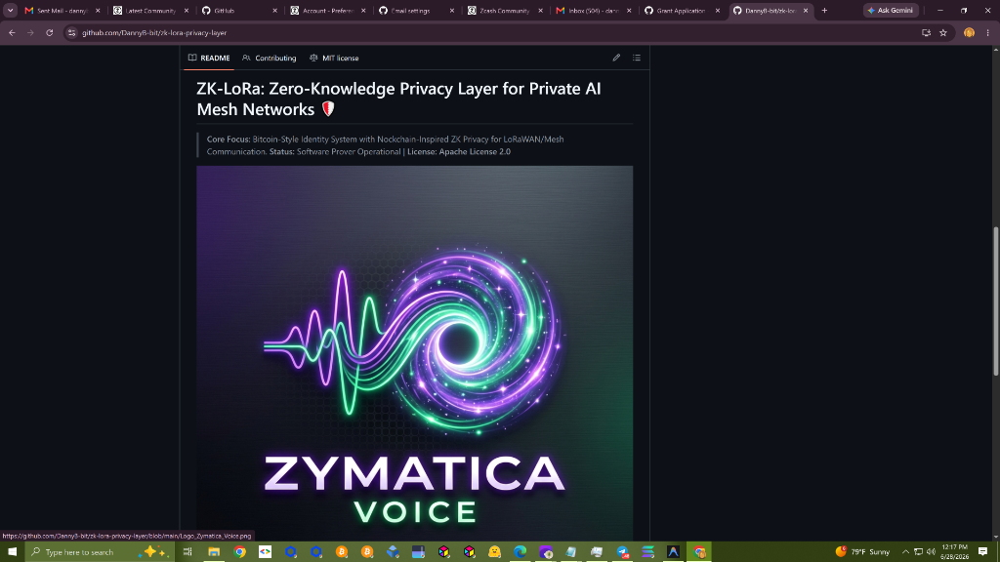

# ZK-LoRa Privacy Layer

*Zero-Knowledge Proofs for Private AI-to-AI Mesh Networks*



> *"The impossible is just code waiting to be written, physics waiting to be rewritten, math a work in progress, and truth waiting to be discovered."*

---

## Overview

The ZK-LoRa Privacy Layer adds **zero-knowledge proof authentication** to the Language-U mesh network. Agents prove they are legitimate network participants **without revealing their hardware identity, private keys, or message contents** to eavesdroppers.

This component combines:
1. **Bitcoin-Style Identity** — ECDSA keypairs (secp256k1) → HASH160 → LoRa phone numbers
2. **Groth16-style ZK-SNARKs** — Prove private key knowledge without revealing it
3. **Proof-of-Useful-Work** — Each packet includes computational proof of agent validity
4. **Unlinkable Transmissions** — Fresh ZK proofs per packet prevent traffic analysis

## Files

| File | Purpose |
| :--- | :--- |
| [WHITEPAPER.md](./WHITEPAPER.md) | Full ZK-LoRa Zcash specification with threat model & security analysis |
| [verify_all_proofs.py](./verify_all_proofs.py) | Master orchestrator verifying ZK proofs across 20 programming languages |
| [run_proof.py](./run_proof.py) | ZK-SNARK prover/verifier implementation + CI proof runner |

## Quick Start

```bash
# Run the proof verification (CI mode)
python run_proof.py --test

# Run the full multi-language verifier
python verify_all_proofs.py

# Run the Milestone 1 benchmark
python benchmark_milestone1.py --iterations 250
```

## Milestone 1 Artifact Pack

Reviewer evidence is collected in [artifacts/milestone1](./artifacts/milestone1/README.md):

| Artifact | Status |
| :--- | :--- |
| `verify_all_proofs.py` report | 20/20 runtimes passing |
| C++ native verifier build/run report | Complete |
| WASM verifier artifact and SHA-256 | Complete |
| Proof generation and verification benchmark | Complete for local reference host |
| 3-node RAK/Raspberry Pi hardware layout | Documented in [docs/milestone1_hardware_layout.md](./docs/milestone1_hardware_layout.md) |
| RAK Miner A/B hardware evidence | Indexed in [docs/MILESTONE_1_REVIEWER_EVIDENCE.md](./docs/MILESTONE_1_REVIEWER_EVIDENCE.md) |

Scope note: this repo proves the Milestone 1 reference prototype, verifier portability, RAK Miner TX/RX hardware bring-up, and one end-to-end raw LoRa RF payload transfer. RAK Miner A completed repeated SX1302 TX bursts; RAK Miner B decoded CRC OK packets during the matching TX window, and the received 240-byte payload SHA-256 matched the transmitted payload SHA-256. Production gnark/arkworks/halo2 proof integration remains future work.

## Security Properties

| Property | Status |
| :--- | :---: |
| Unlinkable transmissions | ✅ |
| Selective disclosure | ✅ |
| Forward secrecy | ✅ |
| Replay protection | ✅ |
| Hardware fingerprint resistance | ✅ |

## License

MIT License — see [LICENSE](./LICENSE)
